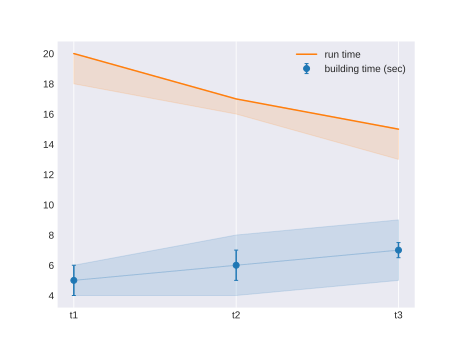
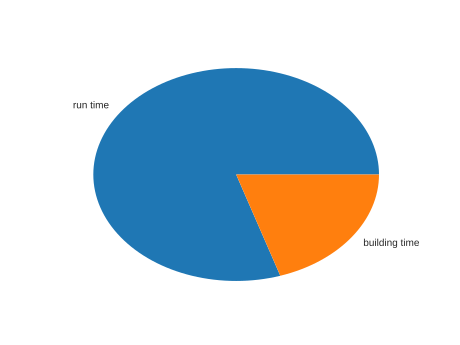

# KVHF
Key Values History File.

This python package come from a suit of software that aim to make your continious integration system able to plot intersting performance related metrics across commits.

You can also use this as an easy way to plot graphs.

## Content

### Executables
1. kvhfplot
2. kvhfutils

### Libs

The package expose python modules that you may find usefull:

1. Modules to manipulate kvhf file ( kvhf.file and kvhf.stat )
2. Wrapper simplifying gitpython interface to facilitate repository exploration(lib.gfe)
3. Some convenients functions to open files even if parents directory does not exist (lib.ppath)

## Install
```bash
pip install kvhf
```

## kvhplot
### File format

A KVHF file is composed from 3 kinds of entity, separated by lines

 1. Labels: Placed at the begining of the file prepended by # and separated by specified key\_sep.
 2. Keys: Anything not starting by -, followed by key\_sep, and somes values separated by precised val\_sep
 3. Attributes : You can give the plotter more information about the last key which will change the way the plotter draw it. See the exemple in next section.


### Exemple
You can use kvhfplot as an easy way to plot data. Imagine you have following file:

```
#t1:t2:t3

building time: 5,  6,7
-maxs:         6, 10, 11
-mins:         4,  5, 6
-stdevs:       1,  2, 3
-unity: sec

run time: 9,7,6
-mins: 4,5,4
```

Then the command
```bash
kvhfplot.py file
```

will output the plot this image:



If your selection match only one label, it switch to pie chart mode:
```bash
kvhfplot.py file -l t1
```



Run kvhfplot.py -h to get more details about how to control what is being plotted (add title, choose keys...)

## Continious Integration and KVHF

The plotter come with utilities to facilitate integration of KVHF continious integration systems, in order to plot metrics at wanted commits.

The recommended way to use kvhf in this purpose will be illustrated in following section. This will also serve as doc to use the package as a whole and wont expose every functionnalities of every tool. You are invited to read the help option of every executable.

The recommended way is to create a one label kvhf file per commit, and to merge with an accumulator at each commit. This way, in each commit, you have:

1. A clean per commit resume file
2. The accumulator to print the past

Without the accumulator, you are gonna need to extract a kvhf from the git history trought kvhfutils --git-extract (see later). But extracting is gonna be slower and slower for every commits.

### Step 1: Script File Creation

First, you need a way to automate a per commit kvhf file creation. For this you can use:
 1. kvhfutils -k to add keys or attribute to allready existing kvhf file.
 2. kvhfutils -m to combine keys of two allready existing kvhf files.
 3. A third party software that produce kvhf files (eprof)

According to your build system, create a script or a target that create that commit resume thanks to those tools. Lets call this generate.bash

ex:
```bash
kvhfutils per_commit_resume.kvf -k exe_size: $(du bin/myexe) -k exe_size:unity:Mo
kvhfutils per_commit_resume.kvf -k exec_time: $(TIMEFMT=%R; time the_perf_test >/dev/null) -k exec_time:unity:ms
```


### Step 2: Commits hooks management

In general you have to understand that changing labels coming from previous commits is going to be super annoying and dangerous (git rebase). And thus you must really be carefull with the choices of your labels.

This step is not mandatory to use kvhf but you are guaranted (if you are human) to make the following mistakes one day:

1. Forgeting to rerun your first step script to overide the per\_commit\_resume file
2. Forgeting to put a label on the new per\_commit\_resume file
3. Forgeting to merge the resume with the accumulator

That's why you should integrate to your commits hooks the following 3 actions\:

#### 1 Forcing Regeneration of Resume

```bash
(pre-commit) generate.bash
```
#### 2 Prevent Misuage of Labels
(pre-commit) kvhfutils --actualized per\_commit\_resume

This will check that the label of the file is existing and not the same as the previous commit one (Will ask you to input a label name if you did not do it in generate)

#### 3 Accumulate Resume
```bash
(pre-commit) kvhfutils -o accumulator.kvhf  --extend accumulator.kvhf per\_commit\_resume
```

This save the need to extract the whole history each time you want to plot it.


## Tricks

The process of choosing wich labels to plot can be tedious even with the regexp selection/filter. Alternatively you can use kvhfutils -g to extract a kvhf file from given commits only. Here you have this commit view that allow you to select commits that modified a particular set of file such as in the following exemple:
```bash
kvhfutils.py --git-extract --path-restrict src/executor.c -p io.c -o important_changes.kvhf
```

You can also specify a list of commits. The labels will be extracted in given order. You can achieve the same results as previous command with:

```bash
kvhutil -g -c $(git rev-list src/executor.c io.c --reverse)
```

## Warning
I did kvhf because I felt the need for it for another project. I built it quicquely and put it on github. I tried to do something powerfull but all the edges features are not tested. I am sure if you try to mess around with features you can read in the help option and not presented here you can encounter some bugs. Pull request accepted :)

## TODO
1. (BASIC) Good gestion of disapparing/appearing key during commits.
2. (label selection) Label in two part, on that is not plotted (the other one is still use for searching labels)
4. (plotting) Smarter way to choose the stale according to keys values
3. (plotting) New attributes to plot?

